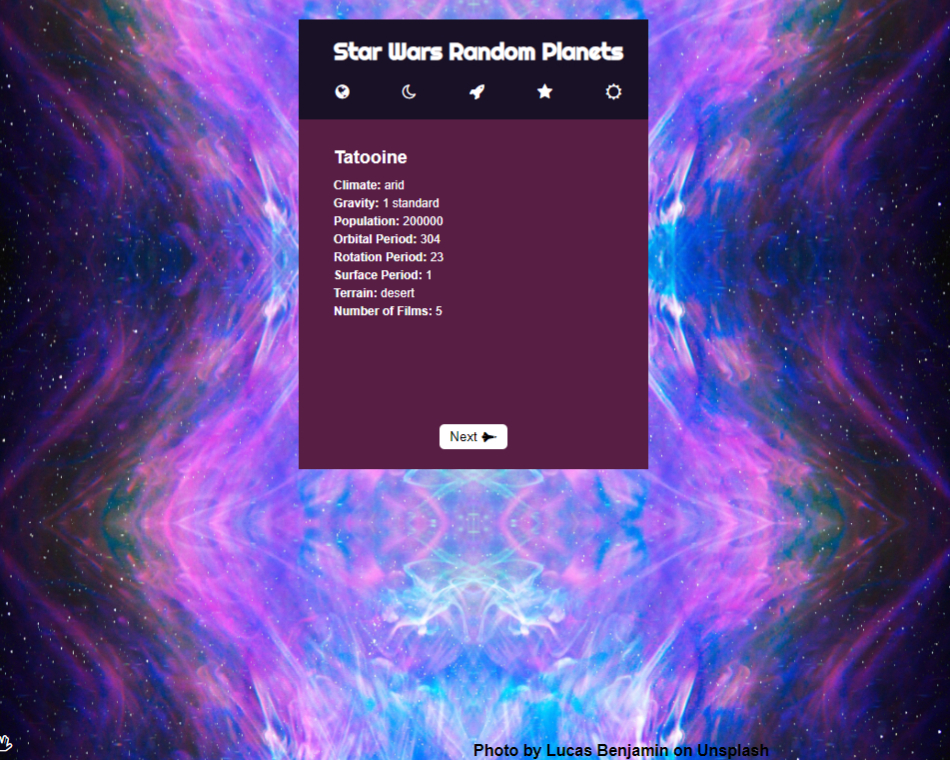

<h1>Star Wars API: Planet Cards</h1>
<h2>Random planets for your trivia!</h2>

<h3>Check it out!</h3>
<a href="https://andreaweb.github.io/star-wars/">
	https://andreaweb.github.io/star-wars/
</a>

<h3>To install the application</h3>

<ul>
    <li>Download it and run <code>npm install</code></li>
</ul>

<h3>To run the application</h3>

<ul>
    <li>Run <code>npm start</code></li>
</ul>

